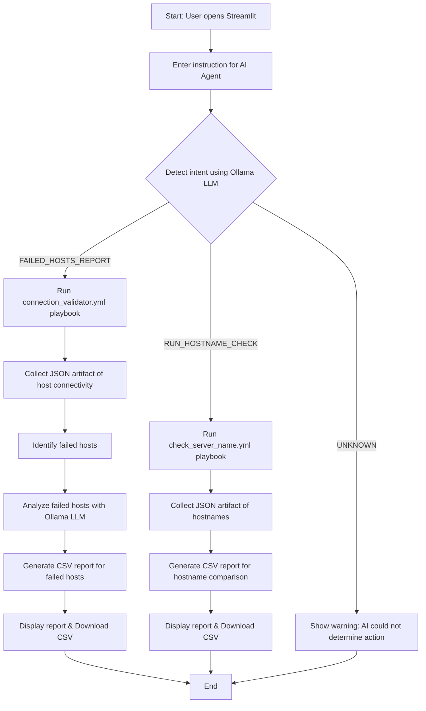

# Ansible AI Agent Demo – Enhanced Version

This repository demonstrates an enhanced Ansible AI Agent using Ansible, Streamlit, and Ollama LLM to automate infrastructure analysis, playbook execution, and CSV reporting.

## Architecture Overview

| Component             | Description                                                                                                      |
| --------------------- | ---------------------------------------------------------------------------------------------------------------- |
| Ansible Controller VM | Azure Linux VM (Ubuntu 24.04, Standard_E2s_v4, 2 vCPU, 16 GB RAM). Hosts Ansible, Python, Streamlit, and Ollama. |
| Ansible Version       | Core 2.16.3                                                                                                      |
| Python & venv         | Isolated Python virtual environment for dependencies                                                             |
| Streamlit             | Version 1.54.0, provides web interface for user prompts and CSV reports                                          |
| LLM Model             | Ollama phi3:mini for AI analysis of failed hosts                                                                 |
| Managed Hosts         | 2 Azure VMs (Debian 12, Standard_D2s_v3), accessed via SSH by Ansible                                            |

## Folder Structure

```
/home/pearlzfan/
├── ansible/
│   ├── connection_validator.yml
│   ├── check_server_name.yml
│   ├── inventory.ini
├── ansible_web/
│   ├── app.py
│   └── venv/
├── artifacts/
│   └── raw_runs/
```

`artifacts/raw_runs` contains standardized JSON outputs for both playbooks.

## System Preparation

### Update system

```
sudo apt update && sudo apt upgrade -y
```

### Install Python and dependencies

```
sudo apt install -y python3 python3-venv python3-distutils python3-pip
python3 -m pip install --upgrade pip
```

### Install Ansible Core

```
python3 -m pip install --user ansible-core==2.16.3
```

### Setup SSH keys for managed hosts

```
ssh-keygen -t rsa -b 4096 -f ~/ansible-controller_key.pem
chmod 600 ~/ansible-controller_key.pem
ssh-copy-id -i ~/ansible-controller_key.pem pearlzfan@10.0.0.7
ssh-copy-id -i ~/ansible-controller_key.pem pearlzfan@10.0.0.8
```

## Ansible Inventory (`inventory.ini`)

```
[linux]
host-vm1 ansible_host=10.0.0.7
host-vm2 ansible_host=10.0.0.8

[all:vars]
ansible_user=pearlzfan
ansible_ssh_private_key_file=/home/pearlzfan/ansible-controller_key.pem
```

## Connection Validator Playbook (`connection_validator.yml`)

```yaml
---
- name: Connection Validator — all hosts
  hosts: localhost
  gather_facts: no
  vars:
    target_group: linux
    run_timestamp: "{{ lookup('pipe','date +%Y%m%d_%H%M%S') }}"

  tasks:
    - name: Ensure raw_runs directory exists
      file:
        path: "{{ playbook_dir }}/../artifacts/raw_runs"
        state: directory
        mode: '0755'

    - name: Initialize results list
      set_fact:
        all_results: []

    - name: Ping each host
      ansible.builtin.ping:
      delegate_to: "{{ item }}"
      register: ping_result
      ignore_unreachable: yes
      ignore_errors: yes
      loop: "{{ groups[target_group] }}"
      loop_control:
        loop_var: item

    - name: Append ping results to all_results
      set_fact:
        all_results: "{{ all_results + [ {
          'hostname': item.item,
          'ip': hostvars[item.item].ansible_host | default('unknown'),
          'os_family': hostvars[item.item].ansible_os_family | default('unknown'),
          'distribution': hostvars[item.item].ansible_distribution | default('unknown'),
          'success': (item.ping is defined and item.ping == 'pong'),
          'details': (item.ping if item.ping is defined and item.ping == 'pong' else 'Host unreachable or SSH failure')
        } ] }}"
      loop: "{{ ping_result.results }}"
      loop_control:
        loop_var: item

    - name: Write JSON artifact
      copy:
        content: "{{ all_results | to_nice_json }}"
        dest: "{{ playbook_dir }}/../artifacts/raw_runs/connection_validator_{{ run_timestamp }}.json"
```

## Server Name Playbook (`check_server_name.yml`)

```yaml
- name: Check Server Hostname
  hosts: linux
  gather_facts: no
  vars:
    run_timestamp: "{{ lookup('pipe','date +%Y%m%d_%H%M%S') }}"

  tasks:
    - name: Collect hostname
      command: hostname
      register: hostname_output
      ignore_errors: yes

    - name: Save result per host
      set_fact:
        result_entry:
          hostname: "{{ inventory_hostname }}"
          ip: "{{ ansible_host }}"
          success: "{{ hostname_output.rc == 0 }}"
          server_name: "{{ hostname_output.stdout | default('unknown') }}"

    - name: Aggregate results
      set_fact:
        all_results: "{{ all_results | default([]) + [ result_entry ] }}"
      run_once: false

    - name: Write JSON artifact (run once)
      copy:
        content: "{{ all_results | to_nice_json }}"
        dest: "/home/pearlzfan/artifacts/raw_runs/check_server_name_{{ run_timestamp }}.json"
      delegate_to: localhost
      run_once: true
```

## Streamlit App (`app.py`)

```python
import streamlit as st
import json
import os
import csv
import requests
from datetime import datetime

# =====================================================
# CONFIGURATION
# =====================================================
ARTIFACTS_DIR = "/home/pearlzfan/artifacts/raw_runs"
ANSIBLE_DIR = "/home/pearlzfan/ansible"
INVENTORY = f"{ANSIBLE_DIR}/inventory.ini"
CSV_DIR = "/home/pearlzfan/ansible_web"
OLLAMA_MODEL = "phi3:mini"
OLLAMA_TIMEOUT = 180

# =====================================================
# CLEANUP OLD FILES
# =====================================================

def cleanup_old_files():
    def keep_newest(directory, extension, prefix=None):
        if not os.path.exists(directory):
            return

        files = [
            os.path.join(directory, f)
            for f in os.listdir(directory)
            if f.endswith(extension)
        ]

        # If prefix is specified, only manage those files
        if prefix:
            files = [f for f in files if os.path.basename(f).startswith(prefix)]

        if len(files) <= 1:
            return

        files.sort(key=os.path.getmtime, reverse=True)

        for f in files[1:]:
            try:
                os.remove(f)
            except:
                pass

    # Keep only newest CSV
    keep_newest(CSV_DIR, ".csv")

    # Keep only newest connection validator JSON
    keep_newest(ARTIFACTS_DIR, ".json", prefix="connection_validator")

    # IMPORTANT: Do NOT delete check_server_name artifacts

cleanup_old_files()

# =====================================================
# STREAMLIT UI
# =====================================================

st.set_page_config(page_title="Ansible AI Agent", layout="wide")
st.title("Ansible AI Agent")

user_prompt = st.text_area(
    "Enter instruction for the AI agent",
    placeholder="Example: Prepare CSV report of failed servers"
)
run_agent = st.button("Run AI Agent")

# =====================================================
# HELPER FUNCTIONS
# =====================================================

def run_playbook(playbook, limit_hosts=None):
    playbook_path = f"{ANSIBLE_DIR}/{playbook}"
    cmd = ["ansible-playbook", "-i", INVENTORY, playbook_path]
    if limit_hosts:
        cmd.extend(["-l", ",".join(limit_hosts)])
    output = os.popen(' '.join(cmd)).read()
    return 0, output


def get_latest_connection_artifact():
    files = [f for f in os.listdir(ARTIFACTS_DIR) if f.startswith("connection_validator") and f.endswith(".json")]
    if not files:
        return None, None
    files.sort(reverse=True)
    latest = os.path.join(ARTIFACTS_DIR, files[0])
    timestamp = files[0].replace("connection_validator_", "").replace(".json", "")
    with open(latest) as f:
        data = json.load(f)
    return data, timestamp


def get_online_hosts_from_connection_validator():
    data, _ = get_latest_connection_artifact()
    if not data:
        return []
    online_hosts = [h.get("hostname") for h in data if h.get("success") is True]
    # debug
    st.write("DEBUG online hosts:", online_hosts)
    return online_hosts


def load_check_server_name_artifacts():
    files = [f for f in os.listdir(ARTIFACTS_DIR) if f.startswith("check_server_name") and f.endswith(".json")]
    if not files:
        return []
    files.sort(reverse=True)
    latest = os.path.join(ARTIFACTS_DIR, files[0])
    try:
        with open(latest) as f:
            data = json.load(f)
            return data if isinstance(data, list) else []
    except Exception as e:
        st.warning(f"Failed to load artifact {latest}: {e}")
        return []

# =====================================================
# INTENT DETECTION
# =====================================================

def detect_user_intent(prompt):
    p = prompt.lower()
    if any(w in p for w in ["failed", "connectivity", "ping"]):
        return "FAILED_HOSTS_REPORT"
    if "hostname" in p:
        return "RUN_HOSTNAME_CHECK"
    return "UNKNOWN"

# =====================================================
# LLM FAILURE ANALYSIS
# =====================================================

def analyze_host_with_llm(host):
    base_prompt = f"""
You are a senior infrastructure automation engineer.
Analyze this host and provide:
Root Cause: <one sentence>
Suggested Fix: <actionable fix>

Host info:
Hostname: {host.get('hostname')}
IP: {host.get('ip')}
Details: {host.get('details')}
"""
    try:
        r = requests.post(
            "http://127.0.0.1:11434/api/generate",
            json={"model": OLLAMA_MODEL, "prompt": base_prompt, "stream": False},
            timeout=OLLAMA_TIMEOUT
        )
        if r.status_code != 200:
            return f"LLM HTTP error: {r.status_code}", "Check Ollama API"
        out = r.json().get("response", "").strip()
        rc, fix = "Unknown", "Manual investigation required"
        for line in out.splitlines():
            if line.lower().startswith("root cause"):
                rc = line.split(":", 1)[1].strip()
            elif line.lower().startswith("suggested fix"):
                fix = line.split(":", 1)[1].strip()
        return rc, fix
    except Exception as e:
        return f"LLM error: {str(e)}", "Check Ollama service"

# =====================================================
# CSV GENERATION
# =====================================================

def generate_failed_hosts_csv(hosts, timestamp):
    rows = []
    for host in hosts:
        rc, fix = analyze_host_with_llm(host)
        rows.append([host.get("hostname"), host.get("ip"), timestamp, rc, fix])
    filename = f"{CSV_DIR}/failed_hosts_report_{datetime.now().strftime('%Y%m%d_%H%M%S')}.csv"
    with open(filename, "w", newline="") as f:
        w = csv.writer(f)
        w.writerow(["Hostname", "IP Address", "Last Playbook Run", "Reason of Fail", "Suggested Fix"])
        w.writerows(rows)
    return filename, rows


def generate_hostname_comparison_csv(data, online_hosts):
    rows = []

    if not data:
        st.error("Hostname artifact is empty — playbook likely didn't write results.")
        return None, []

    st.write("DEBUG raw hostname artifact:", data)

    for host in online_hosts:
        match = None
        for entry in data:
            if entry.get("hostname") == host:
                match = entry
                break

        if match:
            rows.append([host, match.get("server_name", "Unknown")])
        else:
            rows.append([host, "No data returned"])

    filename = f"{CSV_DIR}/hostname_comparison_{datetime.now().strftime('%Y%m%d_%H%M%S')}.csv"
    with open(filename, "w", newline="") as f:
        w = csv.writer(f)
        w.writerow(["Inventory Hostname", "Real Hostname"])
        w.writerows(rows)

    return filename, rows

# =====================================================
# AI AGENT
# =====================================================

if run_agent:
    if not user_prompt:
        st.warning("Please enter an instruction.")
        st.stop()

    intent = detect_user_intent(user_prompt)
    st.info(f"AI detected intent: {intent}")

    if intent == "FAILED_HOSTS_REPORT":
        data, ts = get_latest_connection_artifact()
        if data is None:
            st.error("No connection validator results found.")
            st.stop()
        failed = [h for h in data if not h.get("success")]
        if not failed:
            st.success("All hosts passed connectivity validation.")
            st.stop()
        filename, rows = generate_failed_hosts_csv(failed, ts)
        st.success("CSV report generated")
        st.dataframe(rows)
        with open(filename, "rb") as f:
            st.download_button("Download CSV", f, os.path.basename(filename))

    elif intent == "RUN_HOSTNAME_CHECK":
        st.info("Running hostname comparison playbook on online hosts from connection validator")
        online_hosts = get_online_hosts_from_connection_validator()
        if not online_hosts:
            st.warning("No online hosts found. Run connection validator first.")
            st.stop()

        rc, output = run_playbook("check_server_name.yml", limit_hosts=online_hosts)
        st.code(output)
        if rc != 0:
            st.error("Playbook execution failed.")
            st.stop()

        data = load_check_server_name_artifacts()
        filename, rows = generate_hostname_comparison_csv(data, online_hosts)
        if not rows:
            st.error("No rows generated for hostname comparison.")
            st.stop()

        st.success("Hostname comparison report generated for online hosts")
        st.dataframe(rows)
        with open(filename, "rb") as f:
            st.download_button("Download CSV", f, os.path.basename(filename))

    else:
        st.warning("AI could not determine the requested action.")

```

## Usage Workflow

### Run connection validator playbook

```
ansible-playbook -i ~/ansible/inventory.ini ~/ansible/connection_validator.yml
```

### Generate CSV report for failed hosts

* Open Streamlit
* Enter prompt: `Prepare CSV report of hosts that failed connection validator playbook`

### Run server name playbook on online hosts

* Enter prompt: `Run server name playbook on online hosts`

### Generate CSV report for successful server name checks

* Enter prompt: `Prepare CSV report of successful server name check playbook`

CSV includes actual server names obtained from hosts.


